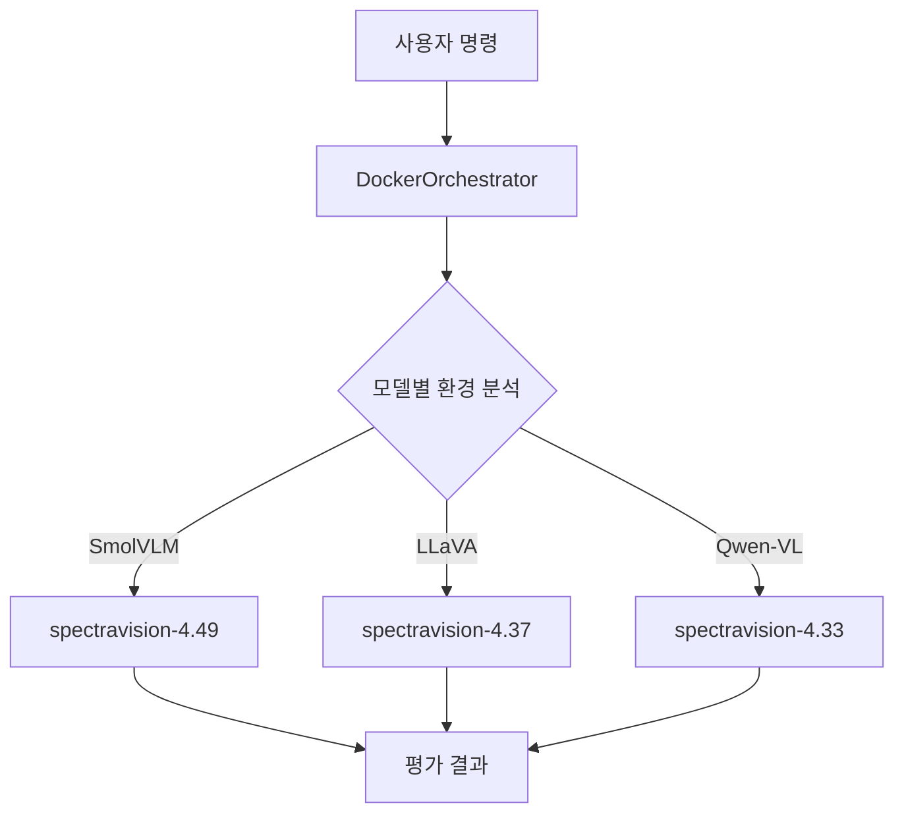

# 🐳 SpectraBench-Vision Docker 완전 가이드

> **"의존성 지옥에서 벗어나 30개 VLM 모델을 단일 명령으로 평가하세요!"**

---

## 🎯 왜 Docker를 사용하나요?

**문제:** Vision-Language 모델들은 서로 다른 `transformers` 버전을 요구합니다
- **SmolVLM** → transformers 4.49.0
- **LLaVA** → transformers 4.37.2  
- **Qwen-VL** → transformers 4.33.0

**해결:** SpectraBench-Vision의 **지능형 Docker 시스템**
- ✅ **자동 컨테이너 선택** - 모델에 맞는 환경 자동 실행
- ✅ **완전한 격리** - 의존성 충돌 없음
- ✅ **재현 가능** - 어디서든 동일한 결과
- ✅ **확장성** - 새 모델/버전 쉽게 추가

---

## ⚡ 가장 빠른 시작 (30초)

### 1️⃣ 토큰 설정 (최초 1회)
```bash
# .env 파일 생성
cp .env.template .env
nano .env  # HUGGING_FACE_HUB_TOKEN=hf_your_token_here
```

### 2️⃣ 즉시 실행 
```bash
# 🎮 대화형 모드로 모든 30개 모델 사용
docker run -it --gpus all \
  -v /var/run/docker.sock:/var/run/docker.sock \
  -v $(pwd)/outputs:/workspace/outputs \
  ghcr.io/gwleee/spectrabench-vision:latest \
  python3 scripts/docker_main.py --mode interactive
```

**✅ 끝!** 메뉴에서 모델과 벤치마크를 선택하면 자동으로 실행됩니다.

---

## 🎮 사용 시나리오별 가이드

### 시나리오 1: "특정 모델만 빠르게 테스트하고 싶어요"

**배치 모드 - 명령줄로 직접 지정:**
```bash
# 예: SmolVLM과 InternVL2로 MMBench 평가
docker run --gpus all \
  -v /var/run/docker.sock:/var/run/docker.sock \
  -v $(pwd)/outputs:/workspace/outputs \
  ghcr.io/gwleee/spectrabench-vision:latest \
  python3 scripts/docker_main.py --mode batch \
  --models "SmolVLM" "InternVL2-2B" \
  --benchmarks "MMBench" "TextVQA"
```

### 시나리오 2: "시스템이 제대로 설치되었는지 확인하고 싶어요"

**시스템 테스트 모드:**
```bash
# 모든 컨테이너 상태 및 GPU 연결 테스트
docker run --rm --gpus all \
  -v /var/run/docker.sock:/var/run/docker.sock \
  ghcr.io/gwleee/spectrabench-vision:latest \
  python3 scripts/docker_main.py --mode test
```

**예상 출력:**
```
SpectraBench-Vision System Test
===============================
✓ Docker connectivity OK
✓ GPU detected: 1 GPU(s) available
✓ Testing 5 container images...
✓ spectravision-4.49: OK (SmolVLM, Qwen2.5-VL ready)
✓ spectravision-4.37: OK (InternVL2, LLaVA ready)
✓ All systems ready for evaluation!
```

### 시나리오 3: "대용량 모델을 다중 GPU로 평가하고 싶어요"

**다중 GPU 활용:**
```bash
# 4개 GPU로 대용량 모델 평가
docker run --gpus all \
  -v /var/run/docker.sock:/var/run/docker.sock \
  -v $(pwd)/outputs:/workspace/outputs \
  ghcr.io/gwleee/spectrabench-vision:latest \
  python3 scripts/docker_main.py --mode batch \
  --models "Qwen2.5-VL-32B" "Qwen2.5-VL-72B" \
  --benchmarks "MMBench" "MMMU" \
  --gpu-ids 0 1 2 3
```

---

## 🧠 DockerOrchestrator가 자동으로 해주는 일들

| 기능 | 설명 | 사용자 혜택 |
|------|------|------------|
| **컨테이너 자동 선택** | SmolVLM → spectravision-4.49 자동 선택 | 버전 관리 걱정 없음 |
| **이미지 자동 다운로드** | 필요한 이미지 자동으로 Registry에서 pull | 수동 관리 불필요 |
| **GPU 자동 할당** | 가용 GPU 감지하여 최적 분배 | 리소스 효율성 최대화 |
| **결과 자동 통합** | 모든 평가 결과를 `outputs/`에 정리 | 결과 관리 간편 |

### 실제 동작 예시:
```
사용자 명령: --models "SmolVLM" "InternVL2-2B"

DockerOrchestrator 자동 처리:
1. 🔍 모델 분석: SmolVLM → 4.49 필요, InternVL2-2B → 4.37 필요
2. 📦 이미지 확인: spectravision-4.49 ✓, spectravision-4.37 ✗ (다운로드 시작)
3. 🚀 컨테이너 실행: GPU 0에서 SmolVLM, GPU 1에서 InternVL2-2B
4. 📊 결과 수집: outputs/timestamp/에 통합 저장
```

---

## 🏗️ 시스템 아키텍처 이해하기



### 컨테이너 구성:

| 컨테이너 | Transformers | 지원 모델 | 메모리 범위 |
|----------|-------------|-----------|------------|
| **spectravision-4.33** | 4.33.0 | Qwen-VL, VisualGLM | 8GB-48GB |
| **spectravision-4.37** | 4.37.2 | InternVL2, LLaVA, ShareGPT4V | 8GB-45GB |
| **spectravision-4.43** | 4.43.0 | Phi-3.5-Vision, Moondream2 | 8GB-18GB |
| **spectravision-4.49** | 4.49.0 | SmolVLM, Qwen2.5-VL, Pixtral | 3GB-300GB |
| **spectravision-4.51** | 4.51.0 | Phi-4-Vision, Llama-4-Scout | 45GB-200GB |

---

## 🔧 이미지 관리 가이드

### 방법 A: 사전 빌드된 이미지 사용 (권장)

**가장 빠르고 쉬운 방법:**
```bash
# 통합 시스템 이미지만 받으면 됨 (다른 이미지들은 자동 다운로드)
docker pull ghcr.io/gwleee/spectrabench-vision:latest

# 또는 모든 이미지 미리 다운로드 (선택사항)
docker pull ghcr.io/gwleee/spectravision-4.33:latest
docker pull ghcr.io/gwleee/spectravision-4.37:latest
docker pull ghcr.io/gwleee/spectravision-4.43:latest
docker pull ghcr.io/gwleee/spectravision-4.49:latest
docker pull ghcr.io/gwleee/spectravision-4.51:latest
```

### 방법 B: 로컬에서 직접 빌드 (개발자용)

**코드를 수정했거나 최신 버전이 필요한 경우:**
```bash
# 전체 이미지 빌드 (시간 소요)
./scripts/build_local_images.sh

# 또는 개별 빌드
docker build -t spectravision-base:latest -f docker/base/Dockerfile .
docker build -t spectravision-4.49:latest -f docker/transformers-4.49/Dockerfile .
docker build -t spectrabench-vision:latest -f docker/integrated/Dockerfile .
```

---

## 🛠️ 문제 해결 가이드

### ❌ "Docker 연결 실패"
```bash
# Docker 서비스 확인
sudo systemctl status docker

# Docker 재시작
sudo systemctl restart docker

# 권한 확인 (Ubuntu)
sudo usermod -aG docker $USER
newgrp docker
```

### ❌ "GPU 인식 안됨"
```bash
# NVIDIA Docker 런타임 확인
docker run --rm --gpus all nvidia/cuda:11.8-runtime-ubuntu22.04 nvidia-smi

# 실패시 NVIDIA Container Toolkit 재설치
distribution=$(. /etc/os-release;echo $ID$VERSION_ID)
curl -s -L https://nvidia.github.io/libnvidia-container/gpgkey | sudo apt-key add -
```

### ❌ "이미지 다운로드 실패"
```bash
# 네트워크 연결 확인
curl -I https://ghcr.io

# Docker 로그인 (필요시)
docker login ghcr.io

# 수동 재시도
docker pull ghcr.io/gwleee/spectrabench-vision:latest
```

### ❌ "메모리 부족"
```bash
# Docker 정리
docker system prune -f
docker volume prune -f

# 더 작은 모델부터 시작
python3 scripts/docker_main.py --mode batch \
  --models "SmolVLM-256M" --benchmarks "MMBench"
```

---

## 📊 출력 결과 이해하기

평가 완료 후 `outputs/` 디렉토리 구조:
```
outputs/
├── logs/                    # 실행 로그
├── reports/                 # 성능 분석 리포트
└── [timestamp]/            # 평가 결과
    ├── SmolVLM/MMBench/    # 모델별 벤치마크 결과
    ├── InternVL2-2B/TextVQA/
    └── performance_monitor.json  # 리소스 사용량
```

**주요 결과 파일:**
- `summary.json` - 전체 평가 요약
- `detailed_results.csv` - 상세 점수표
- `performance_monitor.json` - GPU/메모리 사용량

---

<details>
<summary>🔧 고급 사용법 (개발자용)</summary>

## Docker Compose 사용

### 개발 환경용:
```bash
# 특정 버전만 시작
docker-compose -f docker/docker-compose.yml up -d transformers-4-49

# 컨테이너 내부 접속
docker exec -it spectravision-transformers-4-49 /bin/bash
```

### 프로덕션 환경용:
```bash
# 모든 컨테이너 시작 (프로덕션)
docker-compose -f docker/docker-compose.prod.yml --profile all up -d

# 다중 GPU 환경
GPU_COUNT=4 NVIDIA_VISIBLE_DEVICES=0,1,2,3 \
  docker-compose -f docker/docker-compose.prod.yml --profile all up -d

# 스케일링 (transformers-4-37을 3개 인스턴스로)
docker-compose -f docker/docker-compose.prod.yml --profile stable up -d --scale transformers-4-37=3
```

## 개별 컨테이너 직접 사용

```bash
# 특정 컨테이너에서 직접 평가 실행
docker run --gpus all -it \
  -v $(pwd)/outputs:/workspace/outputs \
  ghcr.io/gwleee/spectravision-4.49:latest

# 컨테이너 내부에서
cd /workspace/VLMEvalKit
python run.py --model SmolVLM-Instruct --data MMBench_DEV_EN --mode all
```

## 새 모델 추가하기

1. VLMEvalKit 지원 확인
2. `configs/models.yaml`에 추가:
```yaml
transformers_4_49:
  models:
    - name: "새모델-7B"
      vlm_id: "정확한_vlmevalkit_id" 
      memory_gb: 28
```
3. 시스템 테스트 실행

</details>

---

## 🎉 성공! 이제 30개 모델로 평가하세요

**축하합니다!** SpectraBench-Vision Docker 시스템 준비 완료!

### ✨ 이제 가능한 것들:
- 🚀 **30개 VLM 모델** 의존성 충돌 없이 평가
- 🤖 **지능형 자동화** DockerOrchestrator가 모든 것을 처리
- 📈 **확장성** 새 모델/벤치마크 쉽게 추가
- 🔧 **완전한 재현성** 어디서든 동일한 결과

### 🎯 지금 바로 시작하기:
```bash
# 대화형 모드로 모든 기능 체험!
docker run -it --gpus all \
  -v /var/run/docker.sock:/var/run/docker.sock \
  -v $(pwd)/outputs:/workspace/outputs \
  ghcr.io/gwleee/spectrabench-vision:latest \
  python3 scripts/docker_main.py --mode interactive
```

**Happy Evaluating! 🚀✨**