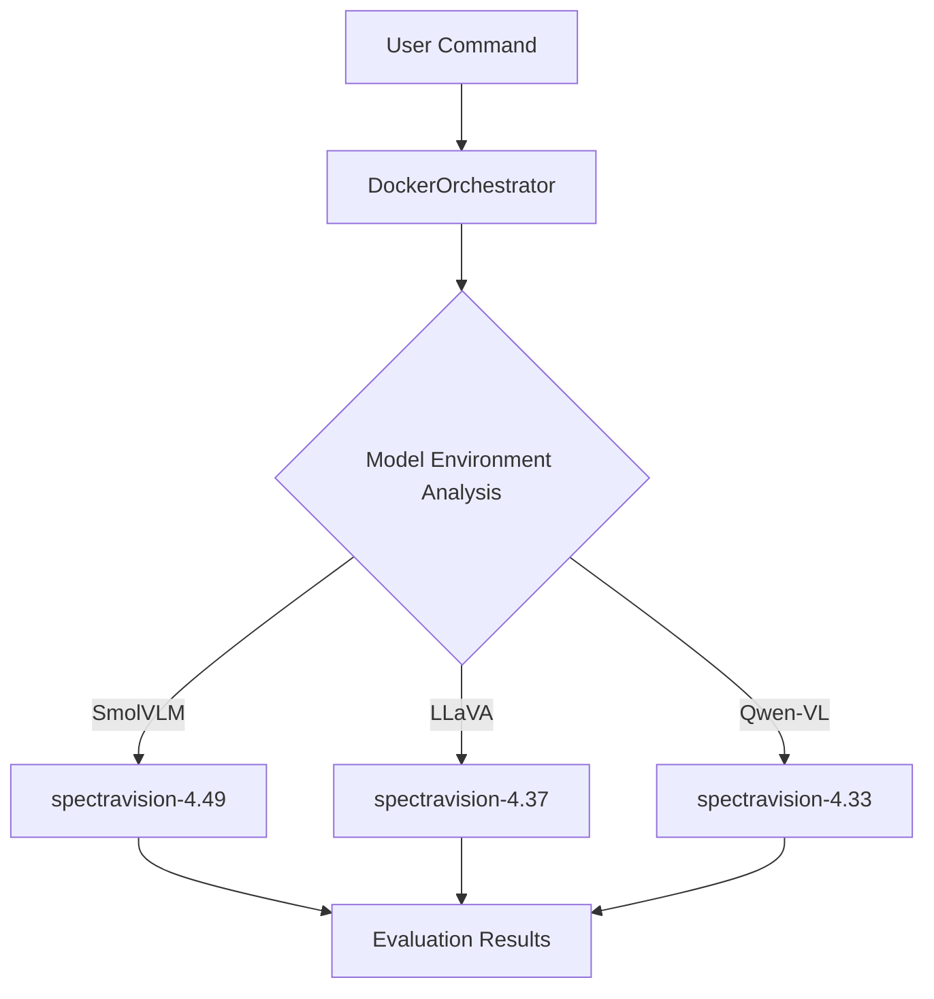

# 🐳 SpectraBench-Vision Docker Complete Guide

> **"Break free from dependency hell and evaluate 30 VLM models with a single command!"**

---

## 🎯 Why Use Docker?

**Problem:** Vision-Language models require different `transformers` versions
- **SmolVLM** → transformers 4.49.0
- **LLaVA** → transformers 4.37.2  
- **Qwen-VL** → transformers 4.33.0

**Solution:** SpectraBench-Vision's **Intelligent Docker System**
- ✅ **Automatic container selection** - Auto-run optimal environment per model
- ✅ **Complete isolation** - No dependency conflicts
- ✅ **Reproducible** - Identical results anywhere
- ✅ **Scalable** - Easy to add new models/versions

---

## ⚡ Quickest Start (30 seconds)

### 1️⃣ Token Setup (One-time)
```bash
# Create .env file
cp .env.template .env
nano .env  # HUGGING_FACE_HUB_TOKEN=hf_your_token_here
```

### 2️⃣ Instant Run 
```bash
# 🎮 Interactive mode with all 30 models
docker run -it --gpus all \
  -v /var/run/docker.sock:/var/run/docker.sock \
  -v $(pwd)/outputs:/workspace/outputs \
  ghcr.io/gwleee/spectravision:latest \
  python3 scripts/docker_main.py --mode interactive
```

**✅ Done!** Select models and benchmarks from the menu to run automatically.

---

## 🎮 Scenario-Based Usage Guide

### Scenario 1: "I want to quickly test specific models"

**Batch mode - Direct command-line specification:**
```bash
# Example: Evaluate SmolVLM and InternVL2 on MMBench
docker run --gpus all \
  -v /var/run/docker.sock:/var/run/docker.sock \
  -v $(pwd)/outputs:/workspace/outputs \
  ghcr.io/gwleee/spectravision:latest \
  python3 scripts/docker_main.py --mode batch \
  --models "SmolVLM" "InternVL2-2B" \
  --benchmarks "MMBench" "TextVQA"
```

### Scenario 2: "I want to verify the system is properly installed"

**System test mode:**
```bash
# Test all container states and GPU connectivity
docker run --rm --gpus all \
  -v /var/run/docker.sock:/var/run/docker.sock \
  ghcr.io/gwleee/spectravision:latest \
  python3 scripts/docker_main.py --mode test
```

**Expected output:**
```
SpectraBench-Vision System Test
===============================
✓ Docker connectivity OK
✓ GPU detected: 1 GPU(s) available
✓ Testing 5 container images...
✓ spectravision-4.49: OK (SmolVLM, Qwen2.5-VL ready)
✓ spectravision-4.37: OK (InternVL2, LLaVA ready)
✓ All systems ready for evaluation!
```

### Scenario 3: "I want to evaluate large models with multi-GPU"

**Multi-GPU utilization:**
```bash
# Evaluate large models with 4 GPUs
docker run --gpus all \
  -v /var/run/docker.sock:/var/run/docker.sock \
  -v $(pwd)/outputs:/workspace/outputs \
  ghcr.io/gwleee/spectravision:latest \
  python3 scripts/docker_main.py --mode batch \
  --models "Qwen2.5-VL-32B" "Qwen2.5-VL-72B" \
  --benchmarks "MMBench" "MMMU" \
  --gpu-ids 0 1 2 3
```

---

## 🧠 What DockerOrchestrator Does Automatically

| Feature | Description | User Benefit |
|---------|-------------|--------------|
| **Auto Container Selection** | SmolVLM → spectravision-4.49 auto-selected | No version management worries |
| **Auto Image Download** | Automatically pulls needed images from Registry | No manual management required |
| **Auto GPU Allocation** | Detects available GPUs and optimally distributes | Maximum resource efficiency |
| **Auto Result Integration** | Consolidates all evaluation results in `outputs/` | Easy result management |

### Real-world Example:
```
User command: --models "SmolVLM" "InternVL2-2B"

DockerOrchestrator automatic processing:
1. 🔍 Model analysis: SmolVLM → needs 4.49, InternVL2-2B → needs 4.37
2. 📦 Image check: spectravision-4.49 ✓, spectravision-4.37 ✗ (download starts)
3. 🚀 Container execution: SmolVLM on GPU 0, InternVL2-2B on GPU 1
4. 📊 Result collection: Consolidated storage in outputs/timestamp/
```

---

## 🏗️ Understanding System Architecture



### Container Configuration:

| Container | Transformers | Supported Models | Memory Range |
|-----------|-------------|------------------|--------------|
| **spectravision-4.33** | 4.33.0 | Qwen-VL, VisualGLM | 8GB-48GB |
| **spectravision-4.37** | 4.37.2 | InternVL2, LLaVA, ShareGPT4V | 8GB-45GB |
| **spectravision-4.43** | 4.43.0 | Phi-3.5-Vision, Moondream2 | 8GB-18GB |
| **spectravision-4.49** | 4.49.0 | SmolVLM, Qwen2.5-VL, Pixtral | 3GB-300GB |
| **spectravision-4.51** | 4.51.0 | Phi-4-Vision, Llama-4-Scout | 45GB-200GB |

---

## 🔧 Image Management Guide

### Method A: Use Pre-built Images (Recommended)

**Fastest and easiest approach:**
```bash
# Only need the integrated system image (others auto-download)
docker pull ghcr.io/gwleee/spectravision:latest

# Or pre-download all images (optional)
docker pull ghcr.io/gwleee/spectravision-4.33:latest
docker pull ghcr.io/gwleee/spectravision-4.37:latest
docker pull ghcr.io/gwleee/spectravision-4.43:latest
docker pull ghcr.io/gwleee/spectravision-4.49:latest
docker pull ghcr.io/gwleee/spectravision-4.51:latest
```

### Method B: Local Build (Developer Use)

**When you've modified code or need the latest version:**
```bash
# Build all images (time-consuming)
./scripts/build_local_images.sh

# Or individual builds
docker build -t spectravision-base:latest -f docker/base/Dockerfile .
docker build -t spectravision-4.49:latest -f docker/transformers-4.49/Dockerfile .
docker build -t spectrabench-vision:latest -f docker/integrated/Dockerfile .
```

---

## 🛠️ Troubleshooting Guide

### ❌ "Docker Connection Failed"
```bash
# Check Docker service
sudo systemctl status docker

# Restart Docker
sudo systemctl restart docker

# Check permissions (Ubuntu)
sudo usermod -aG docker $USER
newgrp docker
```

### ❌ "GPU Not Recognized"
```bash
# Check NVIDIA Docker runtime
docker run --rm --gpus all nvidia/cuda:11.8-runtime-ubuntu22.04 nvidia-smi

# If failed, reinstall NVIDIA Container Toolkit
distribution=$(. /etc/os-release;echo $ID$VERSION_ID)
curl -s -L https://nvidia.github.io/libnvidia-container/gpgkey | sudo apt-key add -
```

### ❌ "Image Download Failed"
```bash
# Check network connection
curl -I https://ghcr.io

# Docker login (if needed)
docker login ghcr.io

# Manual retry
docker pull ghcr.io/gwleee/spectravision:latest
```

### ❌ "Out of Memory"
```bash
# Clean Docker
docker system prune -f
docker volume prune -f

# Start with smaller models
python3 scripts/docker_main.py --mode batch \
  --models "SmolVLM-256M" --benchmarks "MMBench"
```

---

## 📊 Understanding Output Results

After evaluation, `outputs/` directory structure:
```
outputs/
├── logs/                    # Execution logs
├── reports/                 # Performance analysis reports
└── [timestamp]/            # Evaluation results
    ├── SmolVLM/MMBench/    # Model-specific benchmark results
    ├── InternVL2-2B/TextVQA/
    └── performance_monitor.json  # Resource usage
```

**Key result files:**
- `summary.json` - Overall evaluation summary
- `detailed_results.csv` - Detailed score table
- `performance_monitor.json` - GPU/memory usage

---

<details>
<summary>🔧 Advanced Usage (For Developers)</summary>

## Docker Compose Usage

### Development Environment:
```bash
# Start specific version only
docker-compose -f docker/docker-compose.yml up -d transformers-4-49

# Access container interior
docker exec -it spectravision-transformers-4-49 /bin/bash
```

### Production Environment:
```bash
# Start all containers (production)
docker-compose -f docker/docker-compose.prod.yml --profile all up -d

# Multi-GPU environment
GPU_COUNT=4 NVIDIA_VISIBLE_DEVICES=0,1,2,3 \
  docker-compose -f docker/docker-compose.prod.yml --profile all up -d

# Scaling (3 instances of transformers-4-37)
docker-compose -f docker/docker-compose.prod.yml --profile stable up -d --scale transformers-4-37=3
```

## Direct Individual Container Usage

```bash
# Run evaluation directly in specific container
docker run --gpus all -it \
  -v $(pwd)/outputs:/workspace/outputs \
  ghcr.io/gwleee/spectravision-4.49:latest

# Inside container
cd /workspace/VLMEvalKit
python run.py --model SmolVLM-Instruct --data MMBench_DEV_EN --mode all
```

## Adding New Models

1. Confirm VLMEvalKit support
2. Add to `configs/models.yaml`:
```yaml
transformers_4_49:
  models:
    - name: "NewModel-7B"
      vlm_id: "exact_vlmevalkit_id" 
      memory_gb: 28
```
3. Run system test

</details>

---

## 🎉 Success! Now Evaluate with 30 Models

**Congratulations!** SpectraBench-Vision Docker system ready!

### ✨ What You Can Do Now:
- 🚀 **30 VLM models** evaluation without dependency conflicts
- 🤖 **Intelligent automation** DockerOrchestrator handles everything
- 📈 **Scalability** Easy to add new models/benchmarks
- 🔧 **Complete reproducibility** Identical results anywhere

### 🎯 Start Right Now:
```bash
# Experience all features in interactive mode!
docker run -it --gpus all \
  -v /var/run/docker.sock:/var/run/docker.sock \
  -v $(pwd)/outputs:/workspace/outputs \
  ghcr.io/gwleee/spectravision:latest \
  python3 scripts/docker_main.py --mode interactive
```

**Happy Evaluating! 🚀✨**