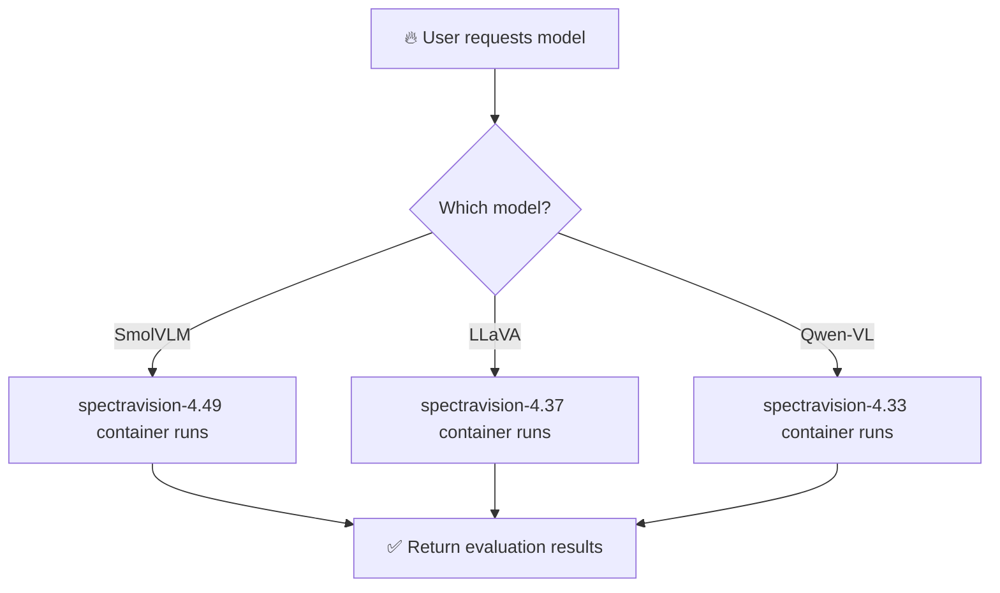

# SpectraBench-Vision 🔍

> **English**: README.en.md | **한국어**: [README.md](README.md)

**Break free from dependency hell! Complete integrated system for evaluating 30 VLM models with a single download**

---

## 🎯 Core Value

**SpectraBench-Vision** is a **Docker-based integrated VLM evaluation system** developed by **KISTI Large-scale AI Research Center**.

### 🏛️ Development Background

**SpectraBench-Vision** developed by the **KISTI Large-scale AI Research Center AI Platform Team** provides model-benchmark combinations based on GPU resources along with comprehensive performance monitoring and analysis capabilities.

The Large-scale AI Research Center officially launched in March 2024 and is based on KISTI's generative large language model 'KONI (KISTI Open Natural Intelligence)' released in December 2023. **The AI Platform Team is responsible for developing AI model and agent service technologies**, and SpectraBench-Vision demonstrates the research center's efforts to build sophisticated evaluation frameworks for the research community.

### 🤔 Why do we need this system?

Vision-Language models require different `transformers` versions:
- **Qwen-VL** → transformers 4.33.0  
- **LLaVA** → transformers 4.37.2
- **SmolVLM** → transformers 4.49.0
- **Phi-4-Vision** → transformers 4.51.0

**Problems with traditional approaches:**
- ❌ Need to reinstall environment for each model
- ❌ Dependency conflicts causing errors  
- ❌ Non-reproducible evaluation environments
- ❌ Complex setup and management

**SpectraBench-Vision Solution:**
- ✅ **All models with single command**
- ✅ **Automatic dependency management** - Auto-select optimal environment per model
- ✅ **Complete reproducibility** - Identical results anywhere
- ✅ **30 models × 24 benchmarks = 720 combinations**

## 🚀 How It Works



**What users run**: `spectrabench-vision:latest` (integrated orchestrator)  
**What happens internally**: Automatically runs appropriate transformer version container per model

> 📖 **Detailed Usage**: [Docker Usage Guide](DOCKER_USAGE_GUIDE_EN.md) | [Docker 사용 가이드 (한국어)](DOCKER_USAGE_GUIDE.md)

---

## ⚡ Quick Start

### 1️⃣ **Token Setup** (30 seconds)
```bash
# Create .env file and add HF token
cp .env.template .env
nano .env  # HUGGING_FACE_HUB_TOKEN=hf_your_token_here
```
> 💡 [Generate Hugging Face Token](https://huggingface.co/settings/tokens) (Read permission)

### 2️⃣ **Run Instantly**
```bash
# 🎮 Interactive mode with all 30 models
docker run -it --gpus all \
  -v /var/run/docker.sock:/var/run/docker.sock \
  -v $(pwd)/outputs:/workspace/outputs \
  ghcr.io/gwleee/spectrabench-vision:latest \
  python3 scripts/docker_main.py --mode interactive
```

**📋 What happens automatically on first run:**

1. **🔄 Integrated Orchestrator Download** (first run only)
   - `spectrabench-vision:latest` image auto-download
   - Docker-in-Docker environment setup complete

2. **🎯 Interactive Menu Launch**
   ```
   ════════ SpectraBench-Vision Interactive Mode ════════
   
   🤖 Model Selection (Choose from 30 models):
   [1] SmolVLM-256M (3GB)     [2] SmolVLM-500M (4GB)
   [3] InternVL2-2B (8GB)     [4] LLaVA-1.5-7B (15GB)
   [5] Qwen2.5-VL-7B (28GB)   [6] More options...
   
   Select (1-30): 
   ```

3. **📊 Benchmark Selection (Choose from 24)**
   ```
   📋 Benchmark Selection:
   [1] MMBench (Basic VQA)    [2] TextVQA (Text Reading)
   [3] DocVQA (Document)      [4] ChartQA (Chart Analysis)
   [5] All benchmarks         [6] More options...
   ```

4. **⚡ Automatic Environment Setup** (after model selection)
   ```
   🔍 Preparing environment for SmolVLM model...
   📥 Downloading spectravision-4.49:latest... [████████████] 100%
   🔧 Applying VLMEvalKit patches automatically...
   ✅ transformers==4.49.0 environment ready!
   ```

5. **🚀 Evaluation Execution**
   - Automatic execution of selected model-benchmark combinations
   - Real-time progress display
   - Results auto-saved: `outputs/[timestamp]/[model]/[benchmark]/`

**💡 Useful Tips:**
- Download time varies based on network conditions
- Start with smaller models if GPU memory is limited
- Press `Ctrl+C` to interrupt evaluation, results are auto-saved
- Check results in the `outputs/` directory

**✅ Done!** Now follow the menus to evaluate with your desired models.

---

## 📖 Usage Scenarios

### 🎮 Interactive Mode (Recommended)
```bash
docker run -it --gpus all \
  -v /var/run/docker.sock:/var/run/docker.sock \
  -v $(pwd)/outputs:/workspace/outputs \
  ghcr.io/gwleee/spectrabench-vision:latest \
  python3 scripts/docker_main.py --mode interactive
```
**After execution**: Select models and benchmarks from menu, automatically runs in appropriate environment.

### ⚡ Batch Evaluation (Performance Comparison)
```bash
# Compare performance across multiple models
docker run --gpus all \
  -v /var/run/docker.sock:/var/run/docker.sock \
  -v $(pwd)/outputs:/workspace/outputs \
  ghcr.io/gwleee/spectrabench-vision:latest \
  python3 scripts/docker_main.py --mode batch \
  --models "SmolVLM" "InternVL2-8B" "Qwen2.5-VL-3B" \
  --benchmarks "MMBench" "TextVQA"
```

### 🧪 System Test (Installation Check)
```bash
docker run --rm --gpus all \
  -v /var/run/docker.sock:/var/run/docker.sock \
  ghcr.io/gwleee/spectrabench-vision:latest \
  python3 scripts/docker_main.py --mode test
```

### 🎛️ GPU Optimization
```bash
# Use specific GPUs
docker run -it --gpus all -e NVIDIA_VISIBLE_DEVICES=0,1 \
  -v /var/run/docker.sock:/var/run/docker.sock \
  ghcr.io/gwleee/spectrabench-vision:latest

# Memory saving (latest models only)
docker run -it --gpus all -e PULL_IMAGES=minimal \
  -v /var/run/docker.sock:/var/run/docker.sock \
  ghcr.io/gwleee/spectrabench-vision:latest
```

---

## 🤖 Supported Models (30)

| Transformer Version | Representative Models | Count | Memory Range |
|-----------------|---------|--------|------------|
| **4.33.0** | Qwen-VL, VisualGLM | 8 | 8GB - 48GB |
| **4.37.2** | InternVL2, LLaVA, ShareGPT4V | 8 | 8GB - 45GB |
| **4.43.0** | Phi-3.5-Vision, Moondream2 | 2 | 8GB - 18GB |
| **4.49.0** | SmolVLM, Qwen2.5-VL, Pixtral | 10 | 3GB - 300GB |
| **4.51.0** | Phi-4-Vision, Llama-4-Scout | 2 | 45GB - 200GB |

**🔥 Popular Models:**
- **SmolVLM**: 256M, 500M, 1.7B (Ultra-lightweight)
- **Qwen2.5-VL**: 3B, 7B, 32B, 72B (Latest generation)  
- **InternVL2**: 2B, 8B (High performance)
- **LLaVA**: 7B, 13B (Stable)

## 📊 Supported Benchmarks (24)

**Total 720 evaluation combinations** (30 models × 24 benchmarks)

| Category | Key Benchmarks |
|------|-------------|
| **Basic VQA** | MMBench, TextVQA, GQA |
| **Document Understanding** | DocVQA, ChartQA, InfoVQA |
| **Science/Professional** | ScienceQA, AI2D, MMMU |
| **Advanced Evaluation** | HallusionBench, MMStar |
| **Korean** | K-MMBench, K-SEED |

---

## 🔍 Troubleshooting

### Common Issues

**❌ "HF_TOKEN is required" Error**
```bash
# Solution: Add token to .env file
cp .env.template .env
echo "HUGGING_FACE_HUB_TOKEN=hf_your_token_here" >> .env
```

**❌ GPU Memory Insufficient**
```bash
# Solution: Use smaller models or specify GPUs
docker run -e NVIDIA_VISIBLE_DEVICES=0 ...  # Use only GPU 0
```

**❌ Docker Image Download Failure**
```bash
# Solution: Check network and manual pull
docker pull ghcr.io/gwleee/spectrabench-vision:latest
```

---

## 📊 Output Results

Evaluation results are saved in `outputs/` directory with timestamps:

```
outputs/
├── logs/                    # Execution logs
├── reports/                 # Performance analysis reports
├── availability_tests/      # Compatibility test results
└── [timestamp]/            # Full evaluation results
    ├── [model]/[benchmark]/  # VLMEvalKit outputs
    └── performance_monitor.json  # Resource usage
```

---

<details>
<summary>🔧 Advanced Usage (For Developers)</summary>

## Local Installation (Development)

```bash
# 1. Setup version-specific VLMEvalKit directories (one-time setup)
./scripts/setup_vlmevalkit_versions.sh

# 2. Direct execution in development environment (limited)
python scripts/main.py --models "InternVL2-2B" --benchmarks "MMBench"
python scripts/main.py --mode interactive
```

## Direct Container Usage

```bash
# Use specific transformer version directly
docker run --gpus all -it ghcr.io/gwleee/spectravision-4.49:latest

# Direct VLMEvalKit usage
cd /workspace/VLMEvalKit
python run.py --model SmolVLM-Instruct --data MMBench_DEV_EN
```

## VLMEvalKit Version Management

**Automatic generation of version-specific VLMEvalKit directories:**
- `VLMEvalKit-4.33/` ~ `VLMEvalKit-4.51/` directories are not included in Git
- Automatically generated during Docker build or local execution
- Version-appropriate patches are automatically applied

```bash
# Manual generation of version directories (if needed)
./scripts/setup_vlmevalkit_versions.sh

# Regenerate specific version only
rm -rf VLMEvalKit-4.49
./scripts/setup_vlmevalkit_versions.sh
```

## Adding New Models

1. Confirm model support in VLMEvalKit
2. Add to appropriate transformer version in `configs/models.yaml`:

```yaml
transformers_4_49:
  models:
    - name: "NewModel-7B"
      vlm_id: "exact_vlmevalkit_id"
      memory_gb: 28
```

</details>

<details>
<summary>📁 Project Structure</summary>

```
SpectraBench-Vision/
├── configs/                   # Configuration files
│   ├── models.yaml           # Model definitions (by transformer version)
│   ├── benchmarks.yaml       # Benchmark list (24 benchmarks)
│   └── hardware.yaml         # GPU memory limits
│
├── docker/                   # Docker infrastructure
│   ├── base/                 # Common base image
│   ├── integrated/           # Integrated system (spectrabench-vision:latest)
│   ├── transformers-4.33/    # 4.33.0 container + requirements.txt
│   ├── transformers-4.37/    # 4.37.2 container + requirements.txt  
│   ├── transformers-4.43/    # 4.43.0 container + requirements.txt
│   ├── transformers-4.49/    # 4.49.0 container + requirements.txt
│   ├── transformers-4.51/    # 4.51.0 container + requirements.txt
│   └── docker-compose.prod.yml # Production orchestration
│
├── spectravision/            # Core evaluation system
│   ├── docker_orchestrator.py # Automatic Docker container management
│   ├── config.py            # Configuration management and hardware detection
│   ├── evaluator.py         # Sequential evaluation engine
│   ├── monitor.py           # Performance monitoring and resource tracking
│   └── utils.py             # Logging and utility functions
│
├── analysis/                 # Performance analysis tools (development)
│   ├── analyzer.py          # Performance analysis engine
│   └── visualizer.py        # Result visualization
│
├── scripts/                  # Execution and build scripts
│   ├── main.py              # Local evaluation main entry point
│   ├── setup_dependencies.py # Automated dependency setup
│   ├── setup_vlmevalkit_versions.sh # VLMEvalKit version directory generator
│   ├── build_local_images.sh # Local Docker image build
│   ├── build_production_images.sh # Production image build
│   └── apply_patches.sh     # Patch application script
│
├── patches/                  # VLMEvalKit token authentication patches (10 patches)
│   ├── 001-moondream-token-fix.patch
│   ├── 002-smolvlm-token-fix.patch
│   └── ... (other model-specific patches)
│
├── VLMEvalKit/              # Base VLMEvalKit (upstream)
├── VLMEvalKit-4.33/         # Transformer 4.33 dedicated (auto-generated)
├── VLMEvalKit-4.37/         # Transformer 4.37 dedicated (auto-generated)  
├── VLMEvalKit-4.43/         # Transformer 4.43 dedicated (auto-generated)
├── VLMEvalKit-4.49/         # Transformer 4.49 dedicated (auto-generated)
├── VLMEvalKit-4.51/         # Transformer 4.51 dedicated (auto-generated)
└── outputs/                 # Results, logs and reports
```

</details>

---

## 📄 License

This project is licensed under the Apache License 2.0.

## 🙏 Acknowledgments

- Built on top of [VLMEvalKit](https://github.com/open-compass/VLMEvalKit)
- Supports models from Hugging Face, LLaVA, and other frameworks

## 🏛️ Citation

```bibtex
@software{spectrabench-vision2025,
  title={SpectraBench-Vision},
  author={KISTI Large-scale AI Research Center},
  year={2025},
  url={https://github.com/gwleee/SpectraBench-Vision/},
  license={Apache-2.0},
}
```

---

*Developed with ❤️ by Gunwoo Lee from the AI Platform Team (Leader: Ryong Lee) at KISTI Large-scale AI Research Center (Director: Kyong-Ha Lee)*

*Supporting the Korean AI ecosystem with intelligent benchmarking tools through automated Docker multi-version evaluation*