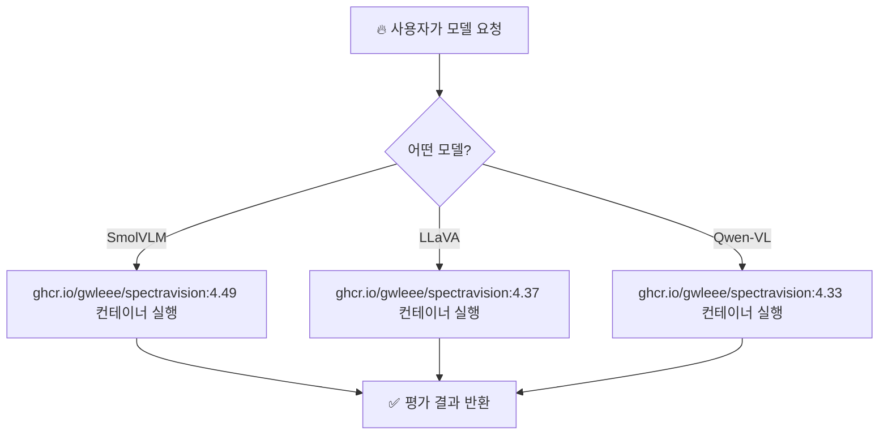

# SpectraBench-Vision 🔍

> **English**: [README.md](README.md) | **한국어**: README.ko.md

**한 번의 다운로드로 30개 VLM 모델을 평가하는 완전 통합 시스템**

---

## 🎯 핵심 가치

**SpectraBench-Vision**은 **KISTI 초거대AI연구센터**에서 개발한 **Docker 기반 통합 VLM 평가 시스템**입니다.

### 🏛️ 개발 배경

**KISTI 초거대AI연구센터 AI플랫폼팀**에서 개발한 SpectraBench-Vision은 GPU 자원에 따른 모델-벤치마크 조합 제공과 종합적인 성능 모니터링 및 분석 기능을 제공합니다.

초거대AI연구센터는 2024년 3월 공식 출범하였으며, 2023년 12월 공개된 KISTI의 생성형 대규모 언어모델 'KONI(KISTI Open Natural Intelligence)'를 기반으로 합니다. **AI 플랫폼팀은 AI 모델 및 에이전트 서비스 기술 개발을 담당**하며, SpectraBench-Vision은 연구 커뮤니티를 위한 정교한 평가 프레임워크 구축에 대한 연구 센터의 노력을 보여줍니다.

### 🤔 왜 이 시스템이 필요한가요?

Vision-Language 모델들은 각기 다른 `transformers` 버전을 요구합니다:
- **Qwen-VL** → transformers 4.33.0  
- **LLaVA** → transformers 4.37.2
- **SmolVLM** → transformers 4.49.0
- **Phi-4-Vision** → transformers 4.51.0

**기존 방식의 문제:**
- ❌ 모델마다 환경을 다시 설치해야 함
- ❌ 의존성 충돌로 인한 에러 발생  
- ❌ 재현 불가능한 평가 환경
- ❌ 복잡한 설정과 관리

**SpectraBench-Vision 해결책:**
- ✅ **단일 명령으로 모든 모델 사용**
- ✅ **자동 의존성 관리** - 모델별 최적 환경 자동 선택
- ✅ **완전한 재현성** - 어디서든 동일한 결과
- ✅ **30개 모델 × 24개 벤치마크 = 720개 조합**

## 🚀 동작 원리



**사용자가 실행하는 것**: `ghcr.io/gwleee/spectravision:latest` (통합 오케스트레이터)  
**내부적으로 일어나는 일**: 모델에 맞는 transformer 버전 컨테이너 자동 실행

> 📖 **자세한 사용법**: [Docker 사용 가이드 (한국어)](DOCKER_USAGE_GUIDE.md) | [Docker Usage Guide (EN)](DOCKER_USAGE_GUIDE_EN.md)

---

## ⚡ Quick Start

### 1️⃣ **토큰 설정** 
```bash
# .env 파일 생성 및 HF 토큰 추가
cp .env.template .env
nano .env  # HUGGING_FACE_HUB_TOKEN=hf_your_token_here
```
> 💡 [Hugging Face 토큰 생성](https://huggingface.co/settings/tokens) (Read 권한)

### 2️⃣ **즉시 실행** 
```bash
# 🎮 대화형 모드로 모든 30개 모델 사용
docker run -it --gpus all \
  -v /var/run/docker.sock:/var/run/docker.sock \
  -v $(pwd)/outputs:/workspace/outputs \
  ghcr.io/gwleee/spectravision:latest \
  python3 scripts/docker_main.py --mode interactive
```

**📋 첫 실행시 자동으로 진행되는 작업들:**

1. **🔄 통합 오케스트레이터 다운로드** (첫 실행시, ~2분)
   - `ghcr.io/gwleee/spectravision:latest` 이미지 자동 다운로드
   - Docker-in-Docker 환경 설정 완료

2. **🎯 대화형 메뉴 시작**
   ```
   ════════ SpectraBench-Vision 대화형 모드 ════════
   
   🤖 모델 선택 (30개 모델 중):
   [1] SmolVLM-256M (3GB)     [2] SmolVLM-500M (4GB)
   [3] InternVL2-2B (8GB)     [4] LLaVA-1.5-7B (15GB)
   [5] Qwen2.5-VL-7B (28GB)   [6] 더 보기...
   
   선택하세요 (1-30): 
   ```

3. **📊 벤치마크 선택 (24개 중)**
   ```
   📋 벤치마크 선택:
   [1] MMBench (기본 VQA)     [2] TextVQA (텍스트 읽기)
   [3] DocVQA (문서 이해)     [4] ChartQA (차트 분석)
   [5] 모든 벤치마크          [6] 더 보기...
   ```

4. **⚡ 자동 환경 구성** (모델 선택 후)
   ```
   🔍 SmolVLM 모델을 위한 환경 준비중...
   📥 ghcr.io/gwleee/spectravision:4.49 다운로드 중... [████████████] 100%
   🔧 최적화된 VLMEvalKit 환경 시작 중...
      ✅ 모든 모델이 자동 토큰 인증과 함께 준비됨
   ✅ transformers==4.49.0 환경 준비 완료!
   ```

   **💡 사용자 참고사항:**
   - **바로 사용 가능**: 30개 모든 모델이 HuggingFace 토큰 인증을 자동으로 처리합니다
   - **설정 불필요**: `.env` 파일의 토큰이 모든 모델에서 자동으로 인식됩니다
   - **설정 제로**: 사전 최적화된 환경으로 즉시 모델 접근 가능

   <details>
   <summary><strong>🔧 기술적 세부사항 (개발자용)</strong></summary>

   **VLMEvalKit 패치에 대하여:**
   - **빌드 시점에 사전 적용**: Docker 이미지 빌드 시 10+ 인증 패치가 적용됩니다
   - **자동 토큰 처리**: 패치를 통해 모델들이 `.env`의 `HUGGING_FACE_HUB_TOKEN`을 읽습니다
   - **포함된 모델**: SmolVLM, Qwen2.5-VL, Phi-4-Vision, InternVL2 등
   - **실행 시 오버헤드 제로**: 평가 시 패치 적용 지연이 없습니다
   - **필요한 이유**: VLMEvalKit 원본이 토큰 인증을 제대로 처리하지 못하기 때문입니다
   </details>

5. **🚀 평가 실행**
   - 선택한 모델-벤치마크 조합 자동 실행
   - 실시간 진행상황 표시
   - 결과 자동 저장: `outputs/[timestamp]/[모델명]/[벤치마크]/`

**💡 유용한 팁:**
- 첫 실행시 네트워크 상태에 따라 다운로드 시간이 달라질 수 있습니다
- GPU 메모리가 부족한 경우 더 작은 모델부터 시작해보세요
- 평가 중 `Ctrl+C`로 중단 가능하며, 결과는 자동 저장됩니다
- 결과는 `outputs/` 디렉토리에서 확인 가능합니다

**✅ 완료!** 이제 메뉴를 따라가면서 원하는 모델로 평가를 진행할 수 있습니다.

---

## 📖 사용 시나리오

### 🎮 대화형 모드 (추천)
```bash
docker run -it --gpus all \
  -v /var/run/docker.sock:/var/run/docker.sock \
  -v $(pwd)/outputs:/workspace/outputs \
  ghcr.io/gwleee/spectravision:latest \
  python3 scripts/docker_main.py --mode interactive
```
**실행 후**: 메뉴에서 모델과 벤치마크를 선택하면 자동으로 적절한 환경에서 실행됩니다.

### ⚡ 배치 평가 (성능 비교)
```bash
# 여러 모델로 성능 비교
docker run --gpus all \
  -v /var/run/docker.sock:/var/run/docker.sock \
  -v $(pwd)/outputs:/workspace/outputs \
  ghcr.io/gwleee/spectravision:latest \
  python3 scripts/docker_main.py --mode batch \
  --models "SmolVLM" "InternVL2-8B" "Qwen2.5-VL-3B" \
  --benchmarks "MMBench" "TextVQA"
```

### 🧪 시스템 테스트 (설치 확인)
```bash
docker run --rm --gpus all \
  -v /var/run/docker.sock:/var/run/docker.sock \
  ghcr.io/gwleee/spectravision:latest \
  python3 scripts/docker_main.py --mode test
```

### 🎛️ GPU 최적화
```bash
# 특정 GPU 사용
docker run -it --gpus all -e NVIDIA_VISIBLE_DEVICES=0,1 \
  -v /var/run/docker.sock:/var/run/docker.sock \
  ghcr.io/gwleee/spectravision:latest

# 메모리 절약 (최신 모델만)
docker run -it --gpus all -e PULL_IMAGES=minimal \
  -v /var/run/docker.sock:/var/run/docker.sock \
  ghcr.io/gwleee/spectravision:latest
```

---

## 🤖 지원 모델 (30개)

| Transformer 버전 | 대표 모델 | 모델 수 | 메모리 범위 |
|-----------------|---------|--------|------------|
| **4.33.0** | Qwen-VL, VisualGLM | 8개 | 8GB - 48GB |
| **4.37.2** | InternVL2, LLaVA, ShareGPT4V | 8개 | 8GB - 45GB |
| **4.43.0** | Phi-3.5-Vision, Moondream2 | 2개 | 8GB - 18GB |
| **4.49.0** | SmolVLM, Qwen2.5-VL, Pixtral | 10개 | 3GB - 300GB |
| **4.51.0** | Phi-4-Vision, Llama-4-Scout | 2개 | 45GB - 200GB |


## 📊 지원 벤치마크 (24개)

**총 720개 평가 조합** (30개 모델 × 24개 벤치마크)

| 분야 | 주요 벤치마크 |
|------|-------------|
| **기본 VQA** | MMBench, TextVQA, GQA |
| **문서 이해** | DocVQA, ChartQA, InfoVQA |
| **과학/전문** | ScienceQA, AI2D, MMMU |
| **고급 평가** | HallusionBench, MMStar |
| **한국어** | K-MMBench, K-SEED |

---

## 🔍 문제 해결

### 자주 발생하는 문제

**❌ "HF_TOKEN is required" 오류**
```bash
# 해결: .env 파일에 토큰 추가
cp .env.template .env
echo "HUGGING_FACE_HUB_TOKEN=hf_your_token_here" >> .env
```

**❌ GPU 메모리 부족**
```bash
# 해결: 더 작은 모델 사용 또는 특정 GPU 지정
docker run -e NVIDIA_VISIBLE_DEVICES=0 ...  # GPU 0만 사용
```

**❌ Docker 이미지 다운로드 실패**
```bash
# 해결: 네트워크 확인 및 수동 pull
docker pull ghcr.io/gwleee/spectravision:latest
```

---

## 📊 출력 결과

평가 결과는 `outputs/` 디렉토리에 타임스탬프와 함께 저장됩니다:

```
outputs/
├── logs/                    # 실행 로그
├── reports/                 # 성능 분석 리포트
├── availability_tests/      # 호환성 테스트 결과
└── [timestamp]/            # 전체 평가 결과
    ├── [모델명]/[벤치마크]/  # VLMEvalKit 출력
    └── performance_monitor.json  # 리소스 사용량
```

---

<details>
<summary>🔧 고급 사용법 (개발자용)</summary>

## 로컬 설치 (개발용)

```bash
# 1. VLMEvalKit 버전별 디렉토리 설정 (최초 1회)
./scripts/setup_vlmevalkit_versions.sh

# 2. 개발 환경에서 직접 실행 (제한적)
python scripts/main.py --models "InternVL2-2B" --benchmarks "MMBench"
python scripts/main.py --mode interactive
```

## 개별 컨테이너 직접 사용

```bash
# 특정 transformer 버전 직접 사용
docker run --gpus all -it ghcr.io/gwleee/spectravision:4.49

# VLMEvalKit 직접 사용
cd /workspace/VLMEvalKit
python run.py --model SmolVLM-Instruct --data MMBench_DEV_EN
```

## VLMEvalKit 버전 관리

**버전별 VLMEvalKit 디렉토리 자동 생성:**
- `VLMEvalKit-4.33/` ~ `VLMEvalKit-4.51/` 디렉토리는 Git에 포함되지 않음
- Docker 빌드 시 또는 로컬 실행 시 자동으로 생성됨
- 각 버전에 맞는 패치가 자동 적용됨

```bash
# 버전별 디렉토리 수동 생성 (필요시)
./scripts/setup_vlmevalkit_versions.sh

# 특정 버전만 재생성
rm -rf VLMEvalKit-4.49
./scripts/setup_vlmevalkit_versions.sh
```

## 새 모델 추가

1. VLMEvalKit에서 모델 지원 확인
2. `configs/models.yaml`의 적절한 transformer 버전에 추가:

```yaml
transformers_4_49:
  models:
    - name: "새모델-7B"
      vlm_id: "정확한_vlmevalkit_id"
      memory_gb: 28
```

</details>

<details>
<summary>📁 프로젝트 구조</summary>

```
SpectraBench-Vision/
├── configs/                   # 설정 파일들
│   ├── models.yaml           # 모델 정의 (transformer 버전별)
│   ├── benchmarks.yaml       # 벤치마크 목록 (24개)
│   └── hardware.yaml         # GPU 메모리 제한
│
├── docker/                   # Docker 인프라
│   ├── base/                 # 공통 베이스 이미지
│   ├── integrated/           # 통합 시스템 (ghcr.io/gwleee/spectravision:latest)
│   ├── transformers-4.33/    # 4.33.0 컨테이너 + requirements.txt
│   ├── transformers-4.37/    # 4.37.2 컨테이너 + requirements.txt  
│   ├── transformers-4.43/    # 4.43.0 컨테이너 + requirements.txt
│   ├── transformers-4.49/    # 4.49.0 컨테이너 + requirements.txt
│   ├── transformers-4.51/    # 4.51.0 컨테이너 + requirements.txt
│   └── docker-compose.prod.yml # 프로덕션 오케스트레이션
│
├── spectravision/            # 핵심 평가 시스템
│   ├── docker_orchestrator.py # Docker 컨테이너 자동 관리
│   ├── config.py            # 설정 관리 및 하드웨어 감지
│   ├── evaluator.py         # 순차 평가 엔진
│   ├── monitor.py           # 성능 모니터링 및 리소스 추적
│   └── utils.py             # 로깅 및 유틸리티 함수
│
├── analysis/                 # 성능 분석 도구 (개발용)
│   ├── analyzer.py          # 성능 분석 엔진
│   └── visualizer.py        # 결과 시각화
│
├── scripts/                  # 실행 및 빌드 스크립트
│   ├── main.py              # 로컬 평가 메인 진입점
│   ├── setup_dependencies.py # 자동화된 의존성 설정
│   ├── setup_vlmevalkit_versions.sh # VLMEvalKit 버전별 디렉토리 생성
│   ├── build_local_images.sh # 로컬 Docker 이미지 빌드
│   ├── build_production_images.sh # 프로덕션 이미지 빌드
│   └── apply_patches.sh     # 패치 적용 스크립트
│
├── patches/                  # VLMEvalKit 토큰 인증 패치 (10개)
│   ├── 001-moondream-token-fix.patch
│   ├── 002-smolvlm-token-fix.patch
│   └── ... (기타 모델별 패치)
│
├── VLMEvalKit/              # 기본 VLMEvalKit (업스트림)
├── VLMEvalKit-4.33/         # transformer 4.33 전용 (자동 생성)
├── VLMEvalKit-4.37/         # transformer 4.37 전용 (자동 생성)  
├── VLMEvalKit-4.43/         # transformer 4.43 전용 (자동 생성)
├── VLMEvalKit-4.49/         # transformer 4.49 전용 (자동 생성)
├── VLMEvalKit-4.51/         # transformer 4.51 전용 (자동 생성)
└── outputs/                 # 결과, 로그 및 리포트
```

</details>

---

## 📄 라이선스

이 프로젝트는 Apache License 2.0 하에 제공됩니다.

## 🙏 Acknowledgments

- Built on top of [VLMEvalKit](https://github.com/open-compass/VLMEvalKit)
- Supports models from Hugging Face, LLaVA, and other frameworks
- Developed for hardware-aware multimodal evaluation

## 🏛️ 인용

```bibtex
@software{ghcr.io/gwleee/spectravision:latest2025,
  title={SpectraBench-Vision},
  author={KISTI Large-scale AI Research Center},
  year={2025},
  url={https://github.com/gwleee/SpectraBench-Vision/},
  license={Apache-2.0},
}
```

---

*Developed with ❤️ by Gunwoo Lee from the AI Platform Team (Leader: Ryong Lee) at KISTI Large-scale AI Research Center (Director: Kyong-Ha Lee)*

*Supporting the Korean AI ecosystem with intelligent benchmarking tools through automated Docker multi-version evaluation*